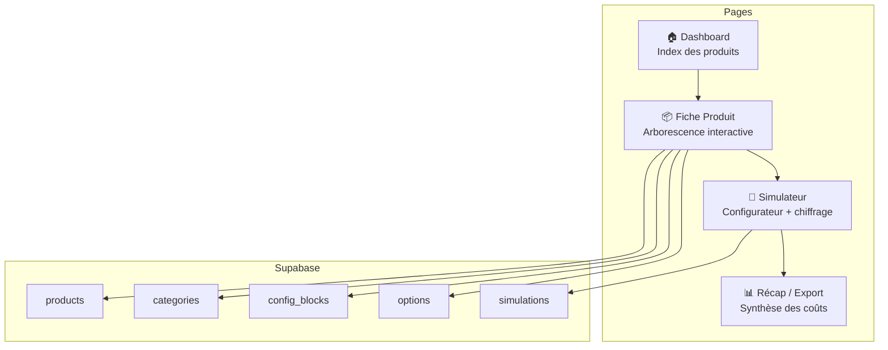

# Offre Produit — Configurateur Interactif & Outil de Chiffrage

## Contexte

Tu as actuellement un diagramme Figma statique qui montre les possibilités de configuration d'opérations (type PROMOGAMING). Ce diagramme est limité : pas d'interactivité, pas de coûts, pas de collaboration.

L'objectif est de construire une **webapp collaborative** qui permet de :
- Visualiser l'arborescence des configurations d'un produit de manière interactive
- Renseigner et consulter les **coûts** (dev, infra, production) de chaque option
- **Simuler** une configuration complète et obtenir un chiffrage total
- Gérer un **index de produits** (pas seulement PROMOGAMING)
- Collaborer en équipe avec sauvegarde en temps réel

---

## Stack Technique

| Couche | Technologie | Justification |
|--------|-------------|---------------|
| Frontend | **Vite + React + TypeScript** | Rapide, typé, évolutif |
| Styling | **CSS Modules + CSS custom properties** | Design premium, pas de dépendance externe |
| Backend / BDD | **Supabase** (PostgreSQL + Auth + Realtime) | Gratuit pour commencer, collaboratif natif, temps réel |
| State Management | **React Context + Supabase Realtime** | Synchronisation multi-utilisateurs |
| Routing | **React Router v6** | Navigation entre produits, configs |
| Langue | **Français** | Interface 100% FR |

---

## Architecture de l'Application

---

## Modèle de Données (Supabase / PostgreSQL)

### Table `products`
| Colonne | Type | Description |
|---------|------|-------------|
| id | uuid (PK) | Identifiant unique |
| name | text | Nom du produit (ex: "PROMOGAMING") |
| description | text | Description du produit |
| icon | text | Emoji ou URL d'icône |
| created_at | timestamptz | Date de création |
| updated_at | timestamptz | Dernière modification |
| created_by | uuid (FK → auth.users) | Créateur |

### Table `categories`
| Colonne | Type | Description |
|---------|------|-------------|
| id | uuid (PK) | Identifiant unique |
| product_id | uuid (FK → products) | Produit parent |
| name | text | Nom (ex: "Paramétrages Communs") |
| color | text | Couleur de la catégorie |
| sort_order | int | Ordre d'affichage |

### Table `config_blocks`
| Colonne | Type | Description |
|---------|------|-------------|
| id | uuid (PK) | Identifiant unique |
| category_id | uuid (FK → categories) | Catégorie parente |
| name | text | Nom du bloc (ex: "Type de Bannière(s)") |
| description | text | Description détaillée |
| dev_time_days | decimal | Temps de dev estimé (jours/homme) |
| infra_cost_monthly | decimal | Coût d'infra mensuel (€) |
| complexity | enum | `simple` / `moyen` / `complexe` |
| dependencies | uuid[] | IDs des blocs dont il dépend |
| notes | text | Notes / contraintes spécifiques |
| sort_order | int | Ordre d'affichage |

### Table `options`
| Colonne | Type | Description |
|---------|------|-------------|
| id | uuid (PK) | Identifiant unique |
| block_id | uuid (FK → config_blocks) | Bloc parent |
| name | text | Nom de l'option (ex: "Achat", "Catégorie") |
| dev_time_days | decimal | Temps de dev additionnel |
| infra_cost_monthly | decimal | Coût d'infra additionnel |
| production_cost | decimal | Coût de production unitaire |
| is_default | boolean | Option par défaut ? |
| sort_order | int | Ordre d'affichage |

### Table `simulations`
| Colonne | Type | Description |
|---------|------|-------------|
| id | uuid (PK) | Identifiant unique |
| product_id | uuid (FK → products) | Produit simulé |
| name | text | Nom de la simulation |
| selected_options | jsonb | IDs des options sélectionnées |
| total_dev_days | decimal | Total jours de dev calculé |
| total_infra_cost | decimal | Total coût infra calculé |
| total_production_cost | decimal | Total coût production |
| created_by | uuid (FK → auth.users) | Créateur |
| created_at | timestamptz | Date de création |

---

## Pages & Fonctionnalités

### 1. 🏠 Dashboard — Index des Produits
- Liste des produits sous forme de **cards premium** avec icône, nom, nombre de blocs, dernier update
- Bouton **"+ Nouveau Produit"** pour en créer un
- Barre de recherche pour filtrer
- Statistiques globales : nombre total de produits, coût moyen, etc.

### 2. 📦 Fiche Produit — Arborescence Interactive
C'est le cœur de l'app, la version interactive de ton Figma :

- **Vue en colonnes/sections** par catégorie (Paramétrages Communs, Ad-hoc, Ciblage, etc.)
- Chaque **bloc** est une carte cliquable avec :
  - Indicateur de complexité (pastille couleur)
  - Icône de coût si > 0
  - Nombre d'options disponibles
- **Au clic sur un bloc** → panneau latéral (drawer) avec :
  - Description détaillée
  - Temps de dev estimé
  - Coût d'infra
  - Complexité technique
  - Dépendances
  - Notes
  - Liste des options avec leurs coûts respectifs
  - **Bouton "Modifier"** pour éditer les infos (collaboratif)
- Les données sont **éditables en ligne** par les utilisateurs autorisés
- **Drag & drop** pour réorganiser les blocs et catégories

### 3. 🧮 Simulateur — Configurateur + Chiffrage
- Interface de sélection : l'utilisateur **coche les options** qu'il veut activer pour sa configuration
- **Calcul en temps réel** qui s'affiche dans un panneau latéral :
  - Total jours de dev
  - Total coût d'infra (mensuel)
  - Total coût de production
  - **Coût global estimé**
- Visualisation des **dépendances** : si tu sélectionnes une option qui nécessite un autre bloc, il est mis en surbrillance
- Bouton **"Sauvegarder cette simulation"**

### 4. 📊 Récap — Synthèse & Export
- Vue synthétique de la simulation sauvegardée
- Comparaison de plusieurs simulations côte à côte
- Export en **PDF** ou **CSV**

---

## Design & UX

- **Dark mode par défaut** avec option light mode
- **Glassmorphism** sur les cartes de blocs
- **Animations fluides** sur les transitions (panneau latéral, hover, sélection)
- **Palette** : tons sombres + accents dorés/ambrés (rappel de ton Figma jaune/orange)
- **Typographie** : Inter (Google Fonts)
- **Responsive** : Desktop-first mais utilisable sur tablette

---

## Proposed Changes

### Phase 1 — Setup du projet

#### [NEW] Projet Vite + React + TypeScript
- Initialisation avec `npx create-vite`
- Configuration du routing (React Router)
- Setup du client Supabase
- Design system de base (CSS custom properties, composants de base)

### Phase 2 — Design System & Composants de base

#### [NEW] src/styles/
- `global.css` — Variables CSS, reset, typographie
- `animations.css` — Animations réutilisables

#### [NEW] src/components/ui/
- `Card.tsx` — Carte glassmorphism réutilisable
- `Drawer.tsx` — Panneau latéral pour les détails
- `Badge.tsx` — Indicateurs de complexité
- `Button.tsx` — Boutons stylisés
- `Input.tsx` — Champs de formulaire
- `Modal.tsx` — Modales
- `CostIndicator.tsx` — Affichage des coûts avec formatage

### Phase 3 — Pages principales

#### [NEW] src/pages/Dashboard.tsx
- Index des produits avec cards
- CRUD produits

#### [NEW] src/pages/ProductView.tsx
- Arborescence interactive des blocs
- Panneau de détails au clic
- Édition inline

#### [NEW] src/pages/Simulator.tsx
- Configurateur avec sélection d'options
- Calcul temps réel des coûts

#### [NEW] src/pages/SimulationRecap.tsx
- Synthèse d'une simulation
- Comparaison

### Phase 4 — Intégration Supabase

#### [NEW] src/lib/supabase.ts
- Client Supabase
- Types TypeScript générés depuis le schéma

#### [NEW] src/hooks/
- `useProducts.ts` — CRUD produits
- `useCategories.ts` — CRUD catégories
- `useBlocks.ts` — CRUD blocs de config
- `useOptions.ts` — CRUD options
- `useSimulations.ts` — CRUD simulations
- `useRealtime.ts` — Abonnement temps réel

### Phase 5 — Données initiales PROMOGAMING

- Script de seed avec toutes les données du diagramme Figma
- Catégories : Paramétrages Communs, Ad-hoc, Ciblage/Audience, Type de Dotation, Emplacement(s)
- Tous les blocs et options visibles sur le diagramme

---

> [!IMPORTANT]
> **Supabase** : Pour que l'app fonctionne, tu devras créer un projet Supabase (gratuit) et me fournir l'URL et la clé anon. Je créerai les tables via des migrations SQL. En attendant, je vais implémenter l'app avec un **mode local** (données en mémoire / localStorage) pour que tu puisses tester immédiatement, puis on branchera Supabase.

> [!NOTE]
> **Approche itérative** : Je vais commencer par construire l'app avec un store local fonctionnel et les données PROMOGAMING pré-remplies. Tu pourras tester l'UX tout de suite. Ensuite on connectera Supabase pour la persistance et la collaboration.

---

## Open Questions

> [!IMPORTANT]
> **Coûts réels** : Est-ce que tu as déjà des estimations de coûts (jours de dev, coûts d'infra) pour les différents blocs et options ? Ou est-ce que l'objectif est justement de créer l'outil pour les renseigner au fur et à mesure ?

> [!IMPORTANT]
> **Authentification** : Pour l'aspect collaboratif, veux-tu un système de login (email/mot de passe via Supabase Auth) ou une app ouverte sans auth pour commencer ?

> [!NOTE]
> **Granularité du diagramme** : Sur ton Figma, je vois des sous-options sous chaque bloc (ex: sous "Type de Bannière(s)" il y a Achat, Catégorie, Marque, etc.). Est-ce que chaque sous-option doit aussi avoir ses propres coûts, ou c'est uniquement au niveau du bloc parent ?

---

## Verification Plan

### Lancement local
- `npm run dev` — L'app se lance sans erreur
- Navigation fluide entre les 4 pages

### Tests fonctionnels
- Création d'un nouveau produit
- Visualisation de l'arborescence PROMOGAMING
- Clic sur un bloc → drawer avec détails
- Modification des coûts d'un bloc
- Simulation : sélection d'options → calcul du coût total
- Sauvegarde d'une simulation

### Tests visuels
- Vérification du design premium (dark mode, glassmorphism, animations)
- Responsive sur différentes tailles d'écran
